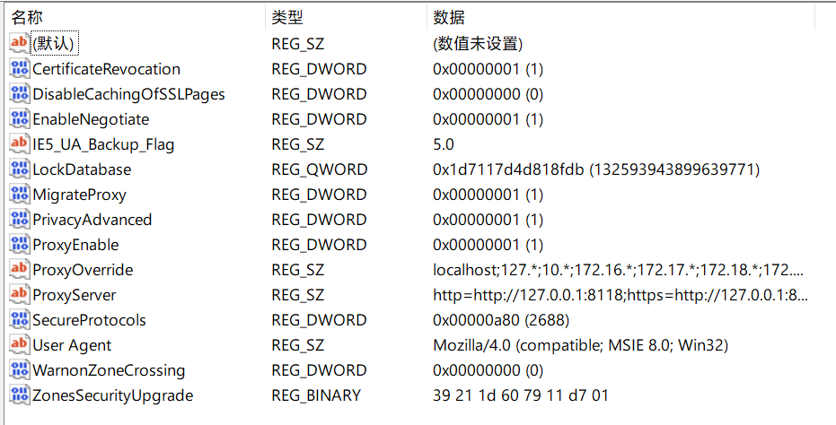

> 原文参考：https://note.bobo.moe/2021/02/clash-for-windows-pip-proxyerror.html

## 问题表现

```
#1
WARNING: Retrying (Retry(total=4, connect=None, read=None, redirect=None, status=None)) after connection broken by 'ProxyError('Cannot connect to proxy.', FileNotFoundError(2, 'No such file or directory'))': /simple/requests/

#2
WARNING: Retrying (Retry(total=4, connect=None, read=None, redirect=None, status=None)) 
after connection broken by 'SSLError(SSLEOFError(8, 'EOF occurred in violation of protocol (_ssl.c:997)'))': /simple/requests/
```

## 搜索源码

`pip/_vendor/urilib3/connectionpool.py`

```python
is_new_proxy_conn = self.proxy is not None and not getattr(
    conn, "sock", None
)
if is_new_proxy_conn and http_tunnel_required:
    self._prepare_proxy(conn)
```

```python
def _prepare_proxy(self, conn):
    """
    Establishes a tunnel connection through HTTP CONNECT.

    Tunnel connection is established early because otherwise httplib would
    improperly set Host: header to proxy's IP:port.
    """

    conn.set_tunnel(self._proxy_host, self.port, self.proxy_headers)

    # 新加的2行代码
    if self.proxy.scheme == "https":
        conn.tls_in_tls_required = True

    conn.connect()
```

https://github.com/pypa/pip/issues/9190

2016 年底，curl 加入了这个把 https 协议前缀另加解释与定义的[联盟](https://daniel.haxx.se/blog/2016/11/26/https-proxy-with-curl/)，而 urllib3 显然也跟上了这个脚步：

`pip/_vendor/urilib3/connection.py`

```python
def connect(self):
    # Add certificate verification
    self.sock = conn = self._new_conn()
    hostname = self.host
    tls_in_tls = False

    if self._is_using_tunnel():
        if self.tls_in_tls_required:
            self.sock = conn = self._connect_tls_proxy(hostname, conn)
            tls_in_tls = True
```

在因为前缀设置了 tls_in_tls_required 之后，urllib3 会企图把这个代理服务器看作一个套了 tls 的 http CONNECT 代理。

但是问题是，并没有设置 https:// 前缀的代理服务器，这个行为是什么神奇的情况呢？
继续向下追，找到如何获取代理的：

```python
def getproxies():
    """Return a dictionary of scheme -> proxy server URL mappings.

    Returns settings gathered from the environment, if specified,
    or the registry.

    """
    return getproxies_environment() or getproxies_registry()
```

确实，env 里面没有 proxy，那按照 windows 的习俗找找注册表也情有可原对吧？这个函数的内部实现是这样：

```python
def getproxies_registry():
    """Return a dictionary of scheme -> proxy server URL mappings.

    Win32 uses the registry to store proxies.

    """
    proxies = {}
    try:
        import winreg
    except ImportError:
        # Std module, so should be around - but you never know!
        return proxies
    try:
        internetSettings = winreg.OpenKey(winreg.HKEY_CURRENT_USER,
            r'Software\Microsoft\Windows\CurrentVersion\Internet Settings')
        proxyEnable = winreg.QueryValueEx(internetSettings,
                                            'ProxyEnable')[0]
        if proxyEnable:
            # Returned as Unicode but problems if not converted to ASCII
            proxyServer = str(winreg.QueryValueEx(internetSettings,
                                                    'ProxyServer')[0])
            if '=' in proxyServer:
                # Per-protocol settings
                for p in proxyServer.split(';'):
                    protocol, address = p.split('=', 1)
                    # See if address has a type:// prefix
                    if not re.match('(?:[^/:]+)://', address):
                        address = '%s://%s' % (protocol, address)
                    proxies[protocol] = address
            else:
                # Use one setting for all protocols
                if proxyServer[:5] == 'http:':
                    proxies['http'] = proxyServer
                else:
                    proxies['http'] = 'http://%s' % proxyServer
                    proxies['https'] = 'https://%s' % proxyServer
                    proxies['ftp'] = 'ftp://%s' % proxyServer
        internetSettings.Close()
    except (OSError, ValueError, TypeError):
        # Either registry key not found etc, or the value in an
        # unexpected format.
        # proxies already set up to be empty so nothing to do
        pass
    return proxies
```

IE 的代理设置把 HTTPS（在 zh-MS 方言里叫安全）代理定义为支持 CONNECT 动词的 HTTP 代理，尽管很久以来人们都是这样用的，但是当它前面出现一个协议前缀的时候就不一样了。

因为 clash for windows 打开系统代理的代理配置看起来并没有写明了 protocol，只有单个 IP:PORT。

所以首先，我们的 py 会根据 IE 时代的约定俗成把这样一个没有指明 protocol 的 proxy url 自动补全三种协议，然后再按照约定俗成的行为为 https 请求使用 https_proxy，最后在一个 http 代理上试图开 tls。

## 解决方法

clash for windows 设置项 cfw 中启用 Specify Protocol。这样注册表里就会完整添加 http/https 前缀。

```python
from urllib.request import getproxies
getproxies()

{'http': 'http://127.0.0.1:8118', 'https': 'http://127.0.0.1:8118'}
```

## 补充问题

cfw 中启用 Specify Protocol 或者 pac 对访问 https 网站依旧无效，最新版已经解决。

问题在于 Clash for Windows 的 **Specify Protocol** 处理其实还是有问题，如果只是单纯地把注册表项的内容由 127.0.0.1:7890 改为 http://127.0.0.1:7890 的话，urllib 只会返回一个只有一个 key 也就是 http 的代理 dict。

这时候从 pip 的请求调用链往上找，可以看到负责决定使用这个 dict 中哪个代理的代码是 requests/utils.py 的 select_proxy 函数：

```python
def select_proxy(url, proxies):
    """Select a proxy for the url, if applicable.

    :param url: The url being for the request
    :param proxies: A dictionary of schemes or schemes and hosts to proxy URLs
    """
    proxies = proxies or {}
    urlparts = urlparse(url)
    if urlparts.hostname is None:
        return proxies.get(urlparts.scheme, proxies.get("all"))

    proxy_keys = [
        urlparts.scheme + "://" + urlparts.hostname,
        urlparts.scheme,
        "all://" + urlparts.hostname,
        "all",
    ]
    proxy = None
    for proxy_key in proxy_keys:
        if proxy_key in proxies:
            proxy = proxies[proxy_key]
            break

    return proxy
```

当请求 https://pypi.org 的时候，只有 key 为 `https` / `https://pypi.org` / `all`/ `all://pypi.org` 的代理会被使用，上面那个 http 的代理自然也就不会被使用。

因为这个代码是 requests 库的，这也就意味着在 Windows 平台上 Clash for Windows 的系统代理不会影响到大部分 py 应用的 http 请求。

同时，因为 urllib 中还存在代理的类型推测代码，所以正确的设置应该是：`http=http://127.0.0.1:7890;https=http://127.0.0.1:7891`。

```
计算机\HKEY_CURRENT_USER\SOFTWARE\Microsoft\Windows\CurrentVersion\Internet Settings
```


